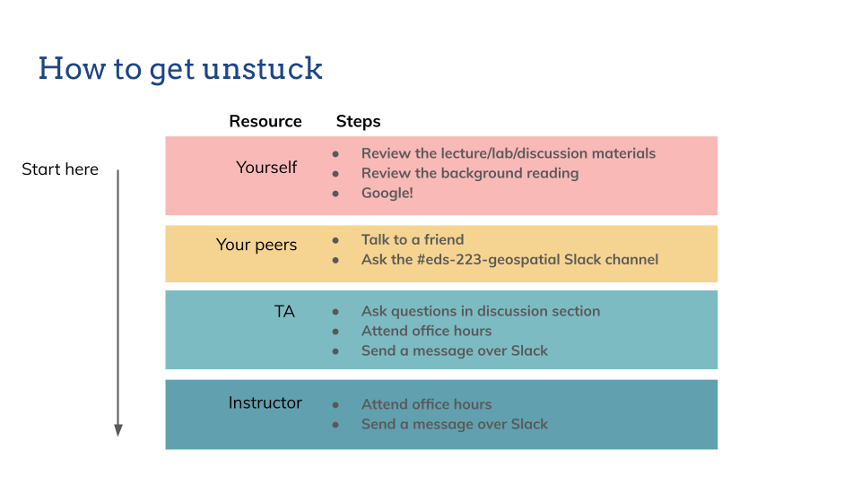

```{r setup, include=FALSE}
knitr::opts_chunk$set(echo = FALSE)

# Learn more about creating websites with Distill at:
# https://rstudio.github.io/distill/website.html

# Learn more about publishing to GitHub Pages at:
# https://rstudio.github.io/distill/publish_website.html#github-pages

```

```{r, out.width = "100%", fig.cap = "Image: Mississippi River south of Memphis, TN, from USGS shared on Unsplash (https://unsplash.com/photos/35Z2ylLRCO8)."}

# UPDATE IMAGE HERE 
# or copy/paste this code elsewhere, updating the file path, to add other images to your site!
knitr::include_graphics("img/usgs_sat.jpeg")
```

## Welcome to EDS 223

This course introduces the spatial modeling and analytic techniques of geographic information science to data science students. The emphasis is on deep understanding of spatial data models and the analytic operations they enable. Recognizing remotely sensed data as a key data type within environmental data science, this course will also introduce fundamental concepts and applications of remote sensing. In addition to this theoretical background, students will become familiar with libraries, packages, and APIs that support spatial analysis in R.

Welcome!

## Teaching team

**Instructor:** Ruth Oliver (rutholiver\@bren.ucsb.edu)

-   **Office:** Bren Hall 4512
-   **Student hours:** Friday 1-2pm PT
-   **The best way to contact me is:** email

**Teaching assistant:** Allie Caughman (acaughman\@bren.ucsb.edu)

-   **Student hours:** Tuesday 12:30-1:30pm PT (location TBD)
-   **The best way to contact me is:** email

## Important links

-   [Course syllabus](syllabus.pdf)

-   [Code of Conduct](https://www.sa.ucsb.edu/regulations/student-conduct-code/student-conduct-code)
-   [Alert us to any absences here](https://forms.gle/vkEHMsRn486WuATH8)

-   [Geocomputation with R](https://geocompr.robinlovelace.net/index.html)


## Weekly course schedule

-   Tuesday 9:30-12:15 PT (Bren Hall 1424)
-   **Discussion section** - Thursday 11:30-12:20 or 12:30-1:20 PT (Bren 3526)


## Course requirements

-   [Minimum MEDS device requirements](https://ucsb-meds.github.io/computer_reqs.html)

-   R version 4.2.0 (or higher)

-   RStudio version 2022.07.01 (or higher)

-   GitHub account


## Tentative topics

| Week | Topics         |
|------|----------------| 
| **1** (10/2) | Course overview & intro to spatial data models| 
| **2** (10/9) | Intro to vector data|
| **3** (10/16) | Vector operations | 
| **4** (10/23) | Intro to raster data & operations|
| **5** (10/30) | Guest speakers|
| **6** (11/6) | Intro to RS & EM radiation| 
| **7** (11/13)  | RS data collection |
| **8** (11/20) | RS of vegetation|
| **9** (11/27) | Multispectral RS analysis|
| **10** (12/4) | Active RS |

```{r, out.width = "100%", fig.cap = ""}

# UPDATE IMAGE HERE 
# or copy/paste this code elsewhere, updating the file path, to add other images to your site!

```
